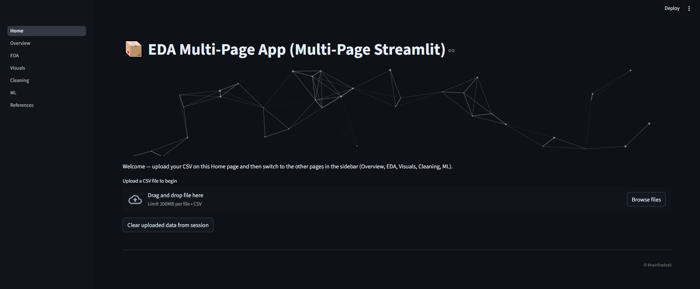
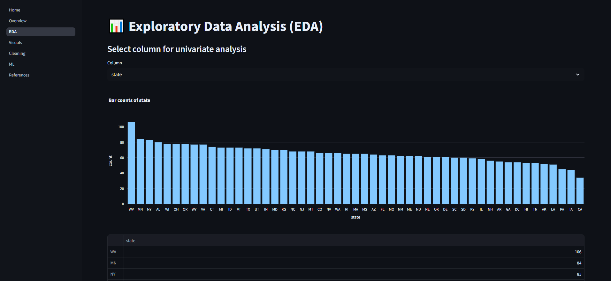
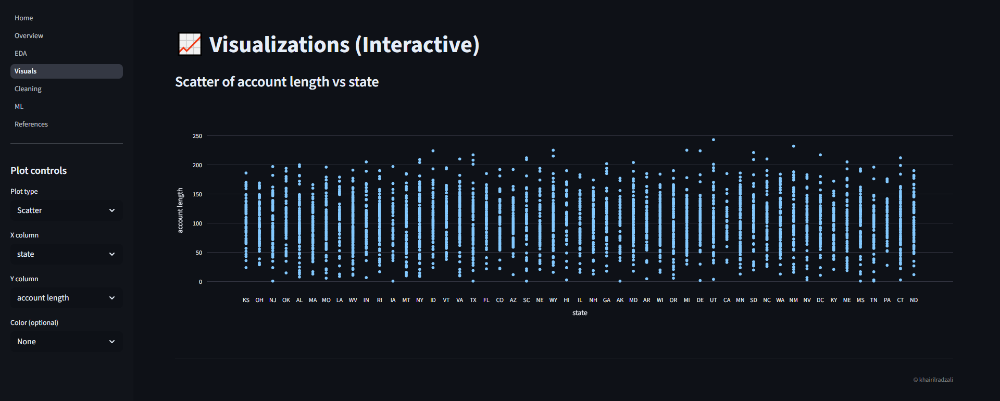
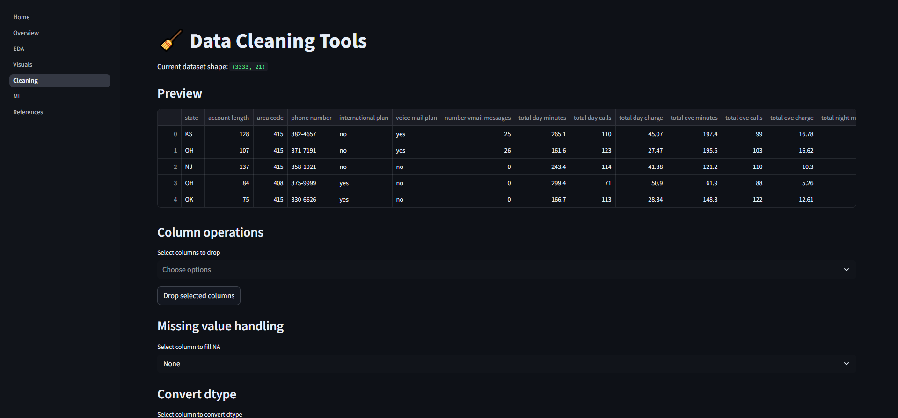
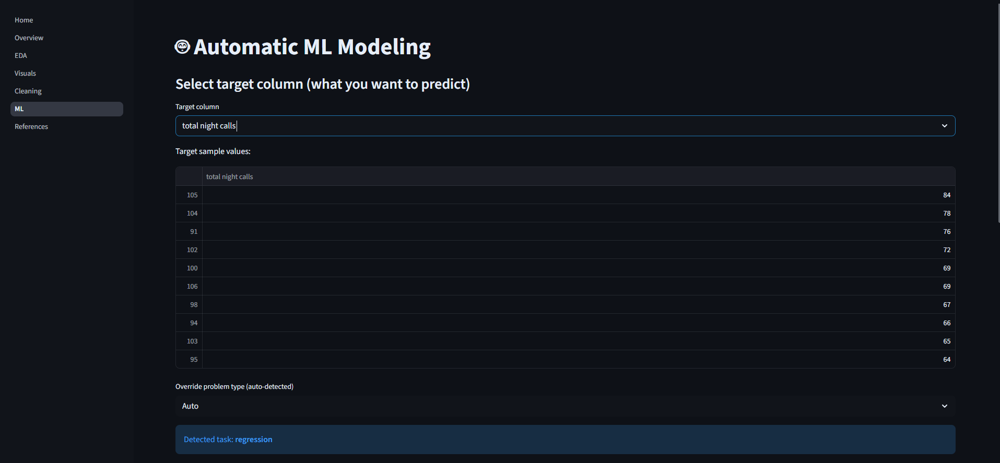
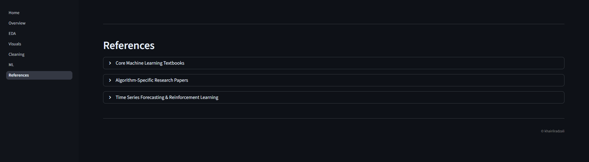

# Multi-Page EDA Streamlit App

## Overview
This is a **multi-page Streamlit app** for Exploratory Data Analysis (EDA), data cleaning, visualization, and automatic ML modeling.

### Features
- Upload CSV files and store in session state
- Overview, EDA, Visuals, Cleaning, ML, and References pages
- Interactive Plotly visualizations
- Particles.js banner on every page
- Footer with © khairilradzali

## Screenshots

**Home Page**  


**Overview Page**  


**EDA Page**  


**Visuals Page**  


**Cleaning Page**  


**ML Page**  


**References Page**  


## Installation
```bash
git clone https://github.com/your-username/streamlit-eda-app.git
cd streamlit-eda-app
pip install -r requirements.txt
streamlit run Home.py
